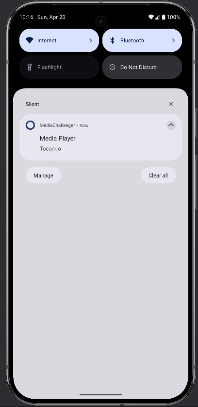
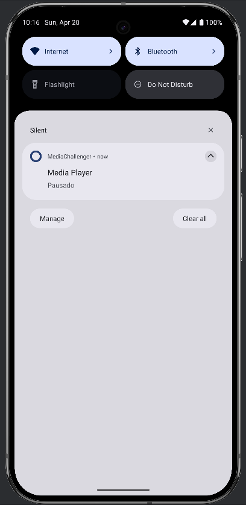

# AudioPlayerComEqualizador

## Equipe

*   Alisson Freitas
*   Eduardo Perez Uanús
*   João Gabriel A. Gomes Alves
*   Rayanne Andrade

## Objetivo do Projeto

Este projeto implementa os métodos do ciclo de vida de um serviço de áudio no Android, criando um serviço de reprodução de áudio com capacidades de equalização. O objetivo é desenvolver um serviço que lide com a reprodução de áudio (formato MP3), forneça recursos básicos de equalização, **e permita a troca dinâmica entre diferentes faixas de áudio.**

## Descrição do Projeto

Esta aplicação Android fornece um serviço de reprodução de áudio que permite aos usuários reproduzir, pausar e parar arquivos de áudio MP3. Também inclui um recurso básico de equalização para ajustar as frequências de áudio. A aplicação utiliza um `AudioService` para gerenciar a reprodução de áudio em segundo plano e utiliza o `MediaPlayer` para o controle do áudio. A comunicação entre a Activity e o Serviço é feita utilizando AIDL (Android Interface Definition Language). **Agora, os usuários podem selecionar diferentes faixas de áudio para reprodução, alterando dinamicamente a música que está sendo tocada.**

## Visão Geral da Interface

Aqui está uma captura de tela da interface principal da aplicação:

<div style="display: flex; flex-direction: 'row'; align-items: 'center';">
    
</div>

Notificações:


<div style="display: flex; flex-direction: row; justify-content: space-between; align-items: center;">
    
    
</div>


## Principais Funcionalidades

*   **Reprodução de Áudio:** Reproduz arquivos de áudio MP3.
*   **Controles de Reprodução:** Inclui funcionalidades de reproduzir, pausar e parar.
*   **Serviço em Segundo Plano:** Utiliza um `AudioService` para lidar com a reprodução em segundo plano.
*   **Equalização (Futuro):** Pretende implementar um equalizador de 5 bandas (atualmente não totalmente implementado).
*   **Notificação Persistente:** Exibe uma notificação persistente com status básicos da reprodução (tocando/pausado).
*   **Comunicação AIDL:** Utiliza AIDL para comunicar entre a Activity e o Serviço.
*   **Seek Bar:** Permite avançar ou retroceder na faixa de áudio.
*   **Controle de Volume:** Permite ajustar o volume da reprodução.
*   **Troca de Faixa Dinâmica:** **Permite aos usuários selecionar diferentes faixas de áudio de uma lista, alterando a música em tempo real.**

## Arquitetura

A aplicação segue uma arquitetura modular:

*   **`AidlServiceManager`:** Gerencia a vinculação e desvinculação do serviço AIDL.
*   **`AudioManager`:** Gerencia a configuração de áudio, como a troca de faixas, comunicando-se com o serviço AIDL.
*   **`AudioSettingsManager`:** Configura os listeners para os botões da interface do usuário (reproduzir, pausar, parar) e gerencia as animações correspondentes.
*   **`AudioService`:** Um serviço que estende `android.app.Service` e implementa a interface AIDL `IMessageService`. Ele lida com a reprodução de áudio utilizando `MediaPlayer` e inclui equalização básica. **Agora também suporta a troca dinâmica de faixas de áudio.**
*   **`MainActivity`:** A activity principal que se vincula ao `AudioService` e fornece a interface do usuário para controlar a reprodução de áudio. **Inclui a lógica para exibir uma lista de faixas e permitir que o usuário selecione uma nova faixa.**
*   **`PermissionManager`:** Gerencia as permissões de tempo de execução para gravação de áudio e acesso à mídia.
*   **`BottomSheetTrackList`**: Mostra uma lista de músicas disponiveis
*   **`SelectedMusicSingleton`**: Salva a música seleciona.

## Módulos

1.  **Módulo de Reprodução:**
    *   Responsável por reproduzir, pausar e parar arquivos de áudio utilizando `MediaPlayer`.
    *   Localizado dentro do `AudioService`.
    *   **Atualizado para suportar a troca dinâmica de faixas.**
2.  **Módulo de Equalização (Parcial):**
    *   Inclui a inicialização da classe `Equalizer`, mas carece de implementação completa.
    *   Localizado dentro do `AudioService`.
3.  **Módulo de Notificação:**
    *   Cria e gerencia uma notificação persistente na barra de status.
    *   Localizado dentro do `AudioService`.

## Tecnologias Utilizadas

*   **Android SDK:** Utilizado para construir a aplicação.
*   **Java:** Linguagem de programação para a lógica da aplicação.
*   **Kotlin:** Linguagem de programação para a Activity.
*   **AIDL (Android Interface Definition Language):** Utilizado para a comunicação entre a Activity e o Serviço.
*   **MediaPlayer:** Utilizado para a reprodução de áudio.
*   **Equalizer:** Utilizado para a equalização de áudio (parcialmente implementado).
*   **Android Studio:** IDE para o desenvolvimento.

## Instruções de Configuração

1.  **Pré-requisitos:**
    *   Android Studio instalado.
    *   Android SDK configurado.
    *   Um dispositivo Android físico ou emulador.

2.  **Clonando o Repositório:**

    ```bash
    git clone [URL do repositório]
    cd [diretório do projeto]
    ```

3.  **Abrindo o Projeto no Android Studio:**
    *   Abra o Android Studio.
    *   Selecione "Open an Existing Project".
    *   Navegue até o diretório do projeto clonado e selecione o arquivo `build.gradle`.

4.  **Construindo e Executando a Aplicação:**
    *   Conecte seu dispositivo Android ou inicie um emulador.
    *   Clique no botão "Run" no Android Studio.
    *   Selecione seu dispositivo/emulador e clique em "OK".

## Explicação do Código

*   **`AidlServiceManager.kt`:**
    *   Gerencia a vinculação e desvinculação ao `AudioService` usando AIDL.
    *   Estabelece uma `ServiceConnection` para lidar com a conexão e desconexão do serviço.
    *   Fornece métodos para verificar se o serviço está vinculado e para obter a interface `IMessageService`.

*   **`AudioManager.kt`:**
    *   Gerencia a configuração de áudio, como a troca de faixas, comunicando-se com o serviço AIDL.
    *   Registra mensagens de sucesso ou falha com base no resultado das chamadas AIDL.

*   **`AudioSettingsManager.kt`:**
    *   Configura os listeners de clique para os botões da interface do usuário (reproduzir, pausar, parar).
    *   Chama os métodos de controle de áudio correspondentes (`playAudio`, `pauseAudio`, `stopAudio`) do `PlaybackModule` quando os botões são clicados.
    *   Gerencia a animação Lottie com base no estado da reprodução.

*   **`MainActivity.kt`:**
    *   A activity principal que inicializa o `AidlServiceManager`, `AudioManager` e `AudioSettingsManager`.
    *   Vincula-se ao `AudioService` quando a activity é criada.
    *   Solicita permissões de áudio utilizando o `PermissionManager`.
    *   Implementa a lógica para as SeekBars de progresso e volume.
    *   **Implementa a lógica para exibir uma lista de faixas e permitir que o usuário selecione uma nova faixa.**

*   **`AudioService.java`:**
    *   Um serviço que estende `android.app.Service` e implementa a interface AIDL `IMessageService`.
    *   Lida com a reprodução de áudio utilizando `MediaPlayer` e inclui equalização básica.
    *   **Agora suporta a troca dinâmica de faixas de áudio através do método `setAudioResource`.**
    *   Cria uma notificação persistente com controles de reprodução.

*   **`PermissionManager.kt`:**
    *   Verifica e solicita permissões de áudio em tempo de execução.
    *   Utiliza a permissão `READ_MEDIA_AUDIO` para Android 13 e superior, e `RECORD_AUDIO` para versões mais antigas.

*   **`IMessageService.aidl`:**
    *   Define a interface para o `AudioService`, permitindo que a Activity chame métodos no Serviço.
    *   Inclui métodos para `playAudio`, `pauseAudio` e `stopAudio`, `seekAudio`, `getDuration`, `getCurrentPosition`, `setVolume`, **e `setAudioResource`**.

*   **`AndroidManifest.xml`:**
    *   Declara as permissões necessárias, o serviço e a activity.
    *   Inclui a declaração da permissão personalizada para o serviço de mensagens.
    *   Especifica o `foregroundServiceType` como `mediaPlayback`.

## Utilização

1.  **Executando a Aplicação:**
    *   Inicie a aplicação em um dispositivo Android ou emulador.
    *   Conceda as permissões de áudio necessárias quando solicitado.
    *   Utilize os botões de reproduzir, pausar e parar na interface do usuário para controlar a reprodução de áudio.
    *   Utilize a SeekBar para controlar o ponto da musica.
    *   Utilize a SeekBar de volume para controlar o volume da musica.
    *   **Selecione uma nova faixa de áudio na lista para alterar a música que está sendo tocada.**

2.  **Interagindo com a Notificação:**
    *   Quando o áudio estiver sendo reproduzido, uma notificação persistente será exibida na barra de status.
    *   Utilize os controles na notificação para gerenciar a reprodução sem abrir a aplicação.

## Melhorias Futuras

*   **Implementar Equalização Completa:**
    *   Concluir a implementação do equalizador de 5 bandas utilizando `AudioTrack` e `Equalizer`.
    *   Permitir que os usuários ajustem as bandas de frequência na interface do usuário.
*   **Adicionar Seleção de Arquivo de Áudio:**
    *   Implementar um seletor de arquivos para permitir que os usuários escolham arquivos de áudio de seus dispositivos.
*   **Melhorar a Interface do Usuário:**
    *   Adicionar mais opções de customização e melhorar o design geral da interface.
*   **Controles na Notificação:**
    *   Adicionar botões de controle (play/pause/stop) à notificação usando `MediaStyle` para uma melhor experiência do usuário.
*   **Controle remoto via `MediaSession`:**
    *   Permitir controlar a reprodução de áudio através de dispositivos externos, como fones de ouvido Bluetooth.

