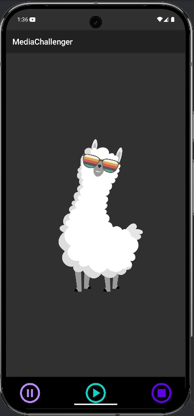

# AudioPlayerComEqualizador

## Equipe

* Alisson Freitas
* Eduardo Perez Uanús
* João Gabriel A. Gomes Alves
* Rayanne Andrade

## Objetivo do Projeto

Este projeto implementa os métodos do ciclo de vida de um serviço de áudio no Android, criando um serviço de reprodução de áudio com capacidades de equalização. O objetivo é desenvolver um serviço que lide com a reprodução de áudio (formato MP3) e forneça recursos básicos de equalização.

## Descrição do Projeto

Esta aplicação Android fornece um serviço de reprodução de áudio que permite aos usuários reproduzir, pausar e parar arquivos de áudio MP3. Também inclui um recurso básico de equalização para ajustar as frequências de áudio. A aplicação utiliza um `AudioService` para gerenciar a reprodução de áudio em segundo plano e utiliza o `MediaPlayer` para o controle do áudio. A comunicação entre a Activity e o Serviço é feita utilizando AIDL (Android Interface Definition Language).

 ## Visão Geral da Interface

 Aqui está uma captura de tela da interface principal da aplicação:

<div style="display: flex; flex-direction: 'row'; align-items: 'center';">
		
</div>

## Principais Funcionalidades

*   **Reprodução de Áudio:** Reproduz arquivos de áudio MP3.
*   **Controles de Reprodução:** Inclui funcionalidades de reproduzir, pausar e parar.
*   **Serviço em Segundo Plano:** Utiliza um `AudioService` para lidar com a reprodução em segundo plano.
*   **Equalização (Futuro):** Pretende implementar um equalizador de 5 bandas (atualmente não totalmente implementado).
*   **Notificação Persistente:** Exibe uma notificação persistente com controles básicos de reprodução (reproduzir/pausar/parar).
*   **Comunicação AIDL:** Utiliza AIDL para comunicar entre a Activity e o Serviço.

## Arquitetura

A aplicação segue uma arquitetura modular:

*   **`AidlServiceManager`:** Gerencia a vinculação e desvinculação do serviço AIDL.
*   **`AudioManager`:** Fornece métodos para controlar a reprodução de áudio (reproduzir, pausar, parar) através do serviço AIDL.
*   **`AudioSettingsManager`:** Configura os listeners para os botões da interface do usuário (reproduzir, pausar, parar) e gerencia as animações correspondentes.
*   **`MessageService`:** Um `AudioService` que estende `android.app.Service` e implementa a interface AIDL `IMessageService`. Ele lida com a reprodução de áudio utilizando `MediaPlayer` e inclui equalização básica.
*   **`MainActivity`:** A activity principal que se vincula ao `MessageService` e fornece a interface do usuário para controlar a reprodução de áudio.
*   **`PermissionManager`:** Gerencia as permissões de tempo de execução para gravação de áudio e acesso à mídia.

## Módulos

1.  **Módulo de Reprodução:**
    *   Responsável por reproduzir, pausar e parar arquivos de áudio utilizando `MediaPlayer`.
    *   Localizado dentro do `MessageService`.
2.  **Módulo de Equalização (Parcial):**
    *   Inclui a inicialização da classe `Equalizer`, mas carece de implementação completa.
    *   Localizado dentro do `MessageService`.
3.  **Módulo de Notificação:**
    *   Cria e gerencia uma notificação persistente na barra de status.
    *   Localizado dentro do `MessageService`.

## Tecnologias Utilizadas

*   **Android SDK:** Utilizado para construir a aplicação.
*   **Java:** Linguagem de programação para a lógica da aplicação.
*   **AIDL (Android Interface Definition Language):** Utilizado para a comunicação entre a Activity e o Serviço.
*   **MediaPlayer:** Utilizado para a reprodução de áudio.
*   **Equalizer:** Utilizado para a equalização de áudio (parcialmente implementado).
*   **Android Studio:** IDE para o desenvolvimento.

## Instruções de Configuração

1.  **Pré-requisitos:**
    *   Android Studio instalado.
    *   Android SDK configurado.
    *   Um dispositivo Android físico ou emulador.

2.  **Clonando o Repositório:**

    ```bash
    git clone [URL do repositório]
    cd [diretório do projeto]
    ```

3.  **Abrindo o Projeto no Android Studio:**
    *   Abra o Android Studio.
    *   Selecione "Open an Existing Project".
    *   Navegue até o diretório do projeto clonado e selecione o arquivo `build.gradle`.

4.  **Construindo e Executando a Aplicação:**
    *   Conecte seu dispositivo Android ou inicie um emulador.
    *   Clique no botão "Run" no Android Studio.
    *   Selecione seu dispositivo/emulador e clique em "OK".

## Estrutura do Código

``AudioPlayerComEqualizador/ ├── app/ │ ├── manifests/ │ │ └── AndroidManifest.xml │ ├── java/ │ │ └── com/example/mediachallenger/ │ │ ├── AidlServiceManager.kt │ │ ├── AudioManager.kt │ │ ├── AudioSettingsManager.kt │ │ ├── MainActivity.kt │ │ ├── MessageService.java │ │ └── PermissionManager.kt │ ├── aidl/ │ │ └── com/example/mediachallenger/ │ │ └── IMessageService.aidl │ └── res/ │ ├── layout/ │ │ └── activity_main.xml │ ├── drawable/ │ │ └── ... (recursos de imagem) │ └── raw/ │ └── test_audio.mp3 (arquivo de áudio de teste) ├── build.gradle └── ...``

## Explicação do Código

*   **`AidlServiceManager.kt`:**
    *   Gerencia a vinculação e desvinculação ao `MessageService` usando AIDL.
    *   Estabelece uma `ServiceConnection` para lidar com a conexão e desconexão do serviço.
    *   Fornece métodos para verificar se o serviço está vinculado e para obter a interface `IMessageService`.

*   **`AudioManager.kt`:**
    *   Fornece métodos (`playAudio`, `pauseAudio`, `stopAudio`) para controlar a reprodução de áudio, chamando os métodos correspondentes na interface `IMessageService`.
    *   Registra mensagens de sucesso ou falha com base no resultado das chamadas AIDL.

*   **`AudioSettingsManager.kt`:**
    *   Configura os listeners de clique para os botões da interface do usuário (reproduzir, pausar, parar).
    *   Chama os métodos de controle de áudio correspondentes (`playAudio`, `pauseAudio`, `stopAudio`) do `AudioManager` quando os botões são clicados.
    *   Gerencia a animação Lottie com base no estado da reprodução.

*   **`MainActivity.kt`:**
    *   A activity principal que inicializa o `AidlServiceManager`, `AudioManager` e `AudioSettingsManager`.
    *   Vincula-se ao `MessageService` quando a activity é criada.
    *   Solicita permissões de áudio utilizando o `PermissionManager`.

*   **`MessageService.java`:**
    *   Um `AudioService` que estende `android.app.Service` e implementa a interface AIDL `IMessageService`.
    *   Lida com a reprodução de áudio utilizando `MediaPlayer`.
    *   Inclui equalização básica utilizando `Equalizer`.
    *   Cria uma notificação persistente com controles de reprodução.

*   **`PermissionManager.kt`:**
    *   Verifica e solicita permissões de áudio em tempo de execução.
    *   Utiliza a permissão `READ_MEDIA_AUDIO` para Android 13 e superior, e `RECORD_AUDIO` para versões mais antigas.

*   **`IMessageService.aidl`:**
    *   Define a interface para o `MessageService`, permitindo que a Activity chame métodos no Serviço.
    *   Inclui métodos para `playAudio`, `pauseAudio` e `stopAudio`.

*   **`AndroidManifest.xml`:**
    *   Declara as permissões necessárias, o serviço e a activity.
    *   Inclui a declaração da permissão personalizada para o serviço de mensagens.
    *   Especifica o `foregroundServiceType` como `mediaPlayback`.

## Utilização

1.  **Executando a Aplicação:**
    *   Inicie a aplicação em um dispositivo Android ou emulador.
    *   Conceda as permissões de áudio necessárias quando solicitado.
    *   Utilize os botões de reproduzir, pausar e parar na interface do usuário para controlar a reprodução de áudio.

2.  **Interagindo com a Notificação:**
    *   Quando o áudio estiver sendo reproduzido, uma notificação persistente será exibida na barra de status.
    *   Utilize os controles na notificação para gerenciar a reprodução sem abrir a aplicação.

## Melhorias Futuras

*   **Implementar Equalização Completa:**
    *   Concluir a implementação do equalizador de 5 bandas utilizando `AudioTrack` e `Equalizer`.
    *   Permitir que os usuários ajustem as bandas de frequência na interface do usuário.
*   **Adicionar Seleção de Arquivo de Áudio:**
    *   Implementar um seletor de arquivos para permitir que os usuários selecionem arquivos de áudio de seus dispositivos.
*   **Melhorar a UI/UX:**
    *   Aprimorar a interface do usuário com melhores controles e visualizações.
*   **Adicionar Suporte a Media Session:**
    *   Implementar `MediaSession` para permitir que dispositivos externos (por exemplo, fones de ouvido Bluetooth) controlem a reprodução.
*   **Tratamento de Erros e Estabilidade:**
    *   Melhorar o tratamento de erros e o registro para tornar a aplicação mais estável.
*   **Testes:** Implementar testes unitários e de integração para garantir a confiabilidade do código.

## Solução de Problemas

*   **Problemas de Permissão:**
    *   Se a aplicação travar ou a reprodução não iniciar, certifique-se de que as permissões de áudio necessárias foram concedidas.
    *   Verifique as configurações da aplicação para verificar se as permissões estão habilitadas.

*   **Problemas de Vinculação de Serviço:**
    *   Se a activity não conseguir se vincular ao serviço, verifique os logs em busca de erros relacionados ao AIDL.
    *   Certifique-se de que o `MessageService` está declarado corretamente no `AndroidManifest.xml`.

*   **Problemas de Reprodução de Áudio:**
    *   Se o áudio não for reproduzido, verifique se o arquivo `test_audio.mp3` está presente na pasta `raw`.
    *   Certifique-se de que o `MediaPlayer` está inicializado corretamente e que não há erros de `IllegalStateException`.


## Agradecimentos

*   Este projeto foi desenvolvido como parte de um exercício acadêmico para implementar os métodos do ciclo de vida de um serviço de áudio no Android.
*   Agradecimentos à comunidade de desenvolvedores Android por fornecer recursos e documentação valiosos.

## Notas Adicionais

*   Este projeto está em andamento e pode conter bugs ou recursos incompletos.
*   Contribuições são bem-vindas! Sinta-se à vontade para fazer um fork do repositório e enviar pull requests.


